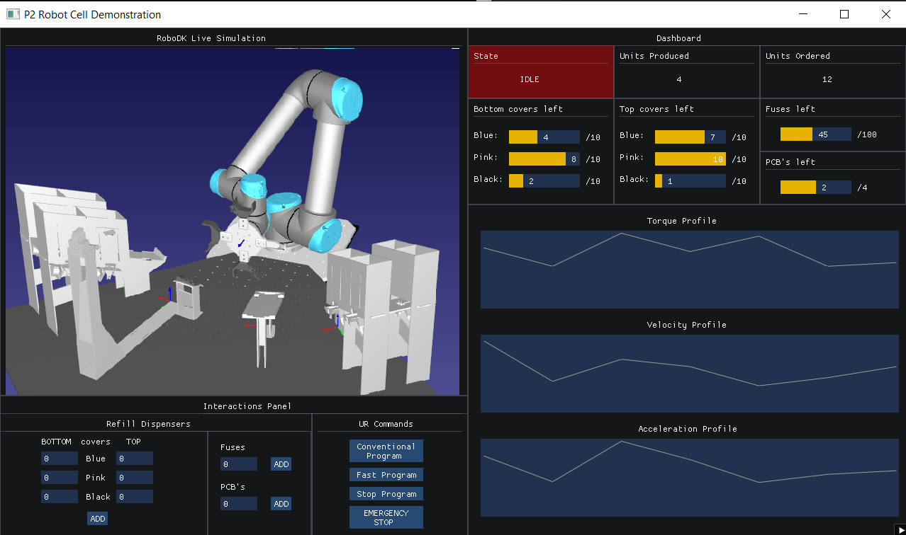

# P2-Demo-Robot-Cell
P2-Demo-Robot-Cell

## TCPServer
To build the GUIServer application please refer to the comments written in imgui example_glfw_opengl.cpp to see dependencies build process for different platforms. The Makefile has been modified to suit a desired file structure for the project. Run make in GUIServer folder (in MSYS2 on windows) to build the application. The App class structure has been set up following a tutorial on YT:
[ImGUI code setup](https://www.youtube.com/watch?v=OYQp0GuoByM&t=1240s) 

