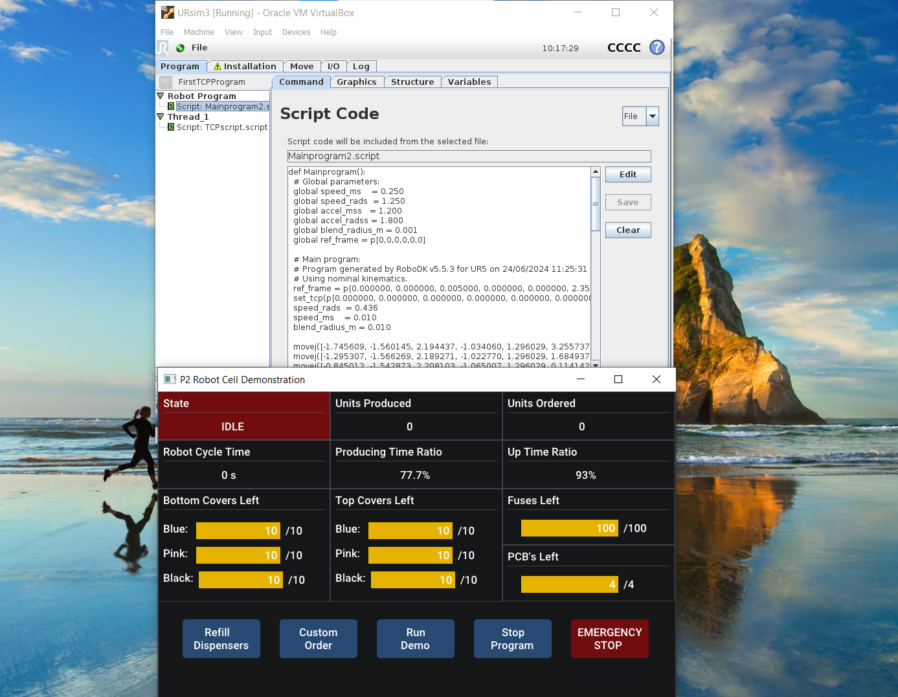

# P2-Demo-Robot-Cell
This GitHub repository contains the relevant code and files for a robot demonstration cell initialy developed by a second semester group at Aalborg University and later refined for robustness and visual appearance. The project aims to demonstrate how an entrance to autonomy does not necessarily have to be as expensive as one might think. This single robot cell stands in contrast to a bigger Festo demonstartion line which, like this robot cell, assembles a dummy phone. Beside an introduction to the cell, build and run instructions for the different applications are given to enable other persons or groups at Aalborg University to operate the cell. 

## TCPServer
To build the GUIServer application please refer to the comments written in imgui example_glfw_opengl.cpp to see dependencies build process for different platforms. The Makefile has been modified to suit a desired file structure for the project. Run make in GUIServer folder (in MSYS2 on windows) to build the application. The App class structure has been set up following a tutorial on YT:
[ImGUI code setup](https://www.youtube.com/watch?v=OYQp0GuoByM&t=1240s) 

