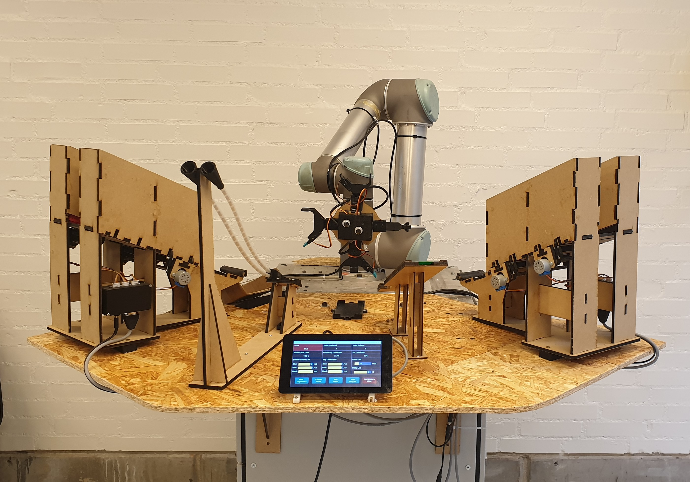

# P2-Demo-Robot-Cell
This GitHub repository contains the relevant code and files for a robot demonstration cell initially developed by a second semester group at Aalborg University and later refined for robustness and visual appearance. The project aims to demonstrate how an entrance to autonomy does not necessarily have to be as expensive as one might think. This single robot cell stands in contrast to a bigger Festo demonstartion line which, like this robot cell, assembles a dummy phone. Beside this introduction to the cell, build and run instructions for the different applications are given to enable other persons or groups at Aalborg University to operate the cell. See the robot cell in action on [YouTube](https://youtu.be/gxAgMTmDVhU).

## How To Run the Cell
The first step to run the cell is making sure that everything is plugged in. There are three plugs that must be plugged into a power outlet: one for the robot, one for the Raspberry Pi and one for the dispensers. When the Raspberry Pi is plugged in it will automatically boot up and start the GUI application after some time. The next step is to start the right program on the UR5 robot. To do so, one must first initialise the robot by going the initialsation screen, turn ON the robot, START the robot, and holding the AUTO button until it is ready. Please notice that this old Polyscope version (1.8) moves a lot when initialising the robot, so make sure that the gripper is not close to any of the dispensers and the table; be careful when holding the AUTO button down. Before pushing AUTO the robot can be moved by hand by pushing the button on the backside of the teach pendant. Now the program can be loaded. Go to the main page and follow these steps:
1. Click "Program Robot"
2. Click "Load Program"
3. Find and open folder "P2-Demo"
4. Open "DemoProgram.urp"
5. Do not load installation file if asked (click "NO")
6. Go to "Installation" tab and choose "Load/Save" in the side panel
7. Click "Load" (Load a different installation file)
8. Open "demo.installation"
9. Go to "Program" tab and click play button to start the program

>[!Note]
>If the robot throws a force limit error the enable button must sometimes be pushed while enabling the robot to free it (can take a few tries). The socket connection to the Pi cannot always be reestablished by simply starting the program again. If this is the case the Raspberry Pi must be rebooted.
>Also please ensure that all grippers are opened before restarting program by going to the IO tab and turning ON/OFF pin 8 and 9 until all are opened.

## RoboDK 
A virtual copy of the robot cell has been created and vastly used throughout the programming of the robtos trajectory. By using the "Generate Program" feature, RoboDK generated the script, which with smaller modifications could be copied and run in the robot controller. The RoboDK station can be found in the "RoboDK" folder. To place the dispensers correctly and create proper target points a combination of the RoboDK python API and manually tweaking has been used, which has ensured a precise relation between the virtual cell and the physical cell. The created RoboDK program can, therefore, be well used if further development or modifcations to the cell setup or trajectory profile is desired. The scripts used to load and place the dispensers as well as creating the target points can be found in "Code/RoboDKScripts".

## GUI Application Build Instructions
The GUI application has been developed to be cross-platform compatible and should therefore be buildable on both windows machines (using MSYS2) and linux machines. Build instructions are given to enable further development by other persons or groups. As an example, the custom order feature has not yet been implemented and could be a nice place to start learning about setup.  
To build the GUIServer application please refer to the comments written in "Code/TCPServer/GUIServer/MakeFile" to see GLFW dependency. When GLFW has been installed, the make command can called in the "GUIServer" folder to build the application. The executable can then be found in the test folder as GUIServerSmall.exe. 

>[!TIP]
>The App class structure for the ImGUI code has been set up following this tutorial on YouTube: [ImGUI code setup](https://www.youtube.com/watch?v=OYQp0GuoByM&t=1240s).

